# RedDrop — Page Workflows and Request Lifecycle

RedDrop is a MERN blood donation and blood-request application. This document describes the **implemented** page-to-database workflows. It is intentionally based on the current codebase, rather than planned endpoints that are not yet present.

## Architecture legend

All diagrams use the same colours:

- Blue — React, Redux, and browser UI
- Orange — Axios and Express API route
- Green — middleware, controller, and business logic
- Purple — MongoDB / Mongoose model
- Yellow — JWT authentication or authorization
- Red — validation or error response

> The frontend Axios base URL is configured in `frontend/src/api/axiosInstance.js`. In production it targets the Render API with the `/api` suffix.

## 1. Application startup and protected routes

On every app load, React restores an existing local session. Protected React routes then require `auth.isAuthenticated` before rendering.

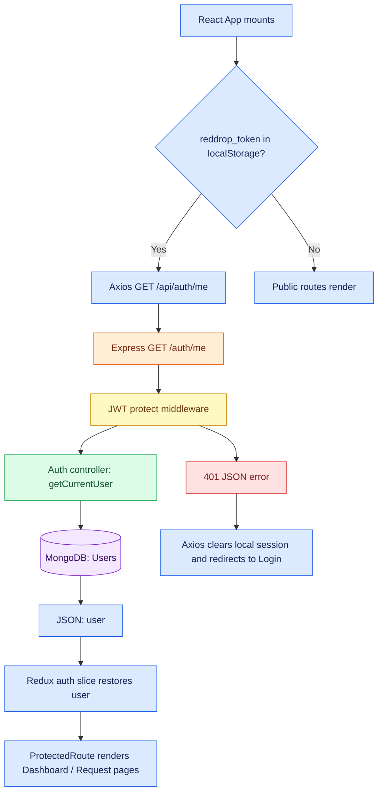

## 2. Login page — `/login`

The Login page authenticates by **email and password**. The backend compares the submitted password with the bcrypt hash, issues a JWT, and also sets an HTTP-only cookie. Redux persists the token and user in local storage, then React navigates to the dashboard.

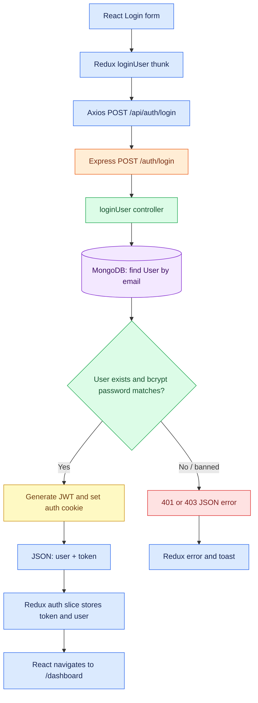

## 3. Register page — `/register`

Registration is an OTP-first flow. No user is created until the submitted code is verified.

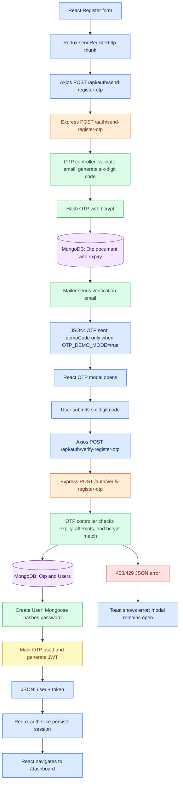

**Timing:** OTP expiry and resend limits are configured in `backend/controllers/otpController.js`. The current values are one-minute expiry, 15-second resend delay, three resends, and five verification attempts.

## 4. Forgot Password page — `/forgot-password`

The reset flow uses the same `Otp` collection but a separate `reset` type. The API intentionally returns a generic success response for an unknown email, avoiding account enumeration.

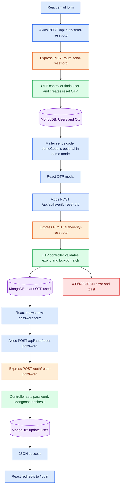

## 5. Home page — `/`

The home page is public. It displays three static statistic cards and retrieves up to three urgent, open blood requests.

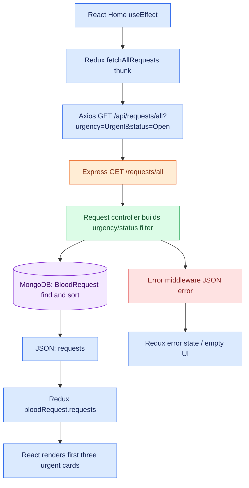

## 6. Dashboard page — `/dashboard` (authenticated)

The dashboard makes two requests after `ProtectedRoute` allows entry: the signed-in user's requests and currently open requests in the user's city.

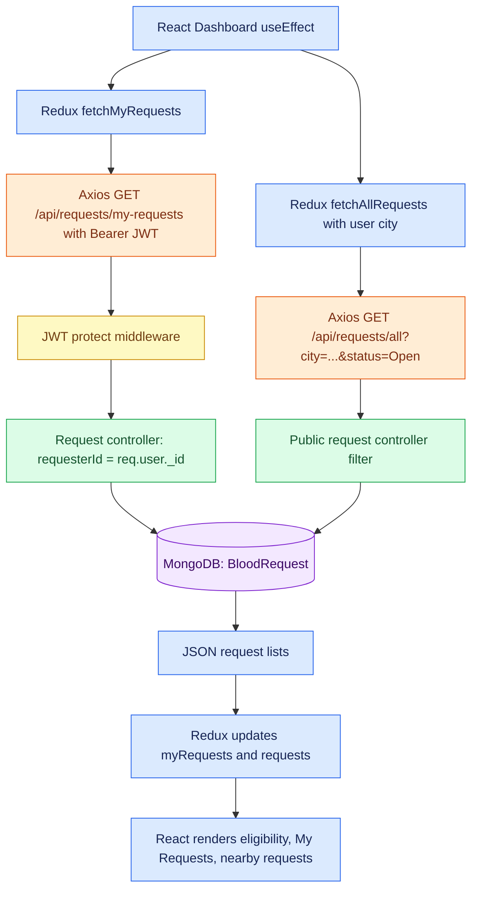

## 7. Find Donors page — `/search-donors`

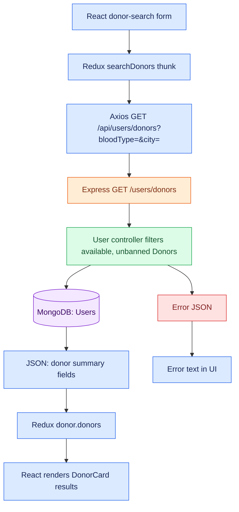

## 8. Create Blood Request page — `/request-blood` (authenticated)

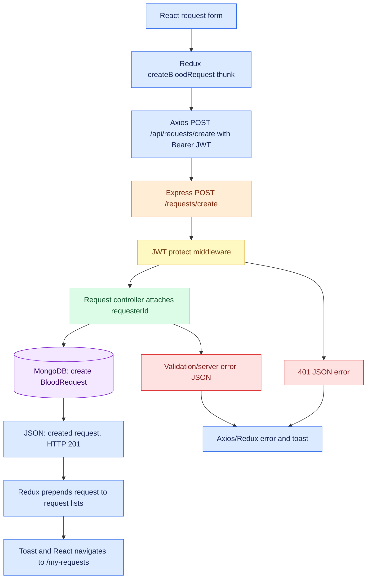

## 9. My Blood Requests page — `/my-requests` (authenticated)

This page loads the signed-in user's requests and lets the request owner (or an admin) update a request status.

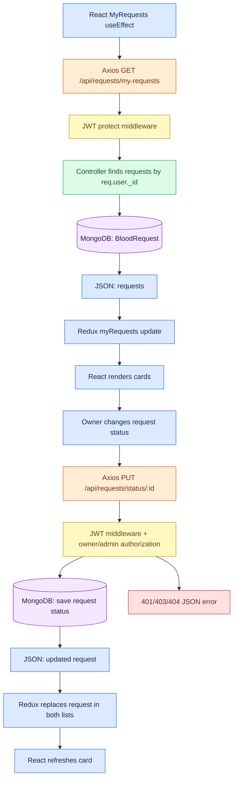

## 10. Active Blood Requests page — `/requests`

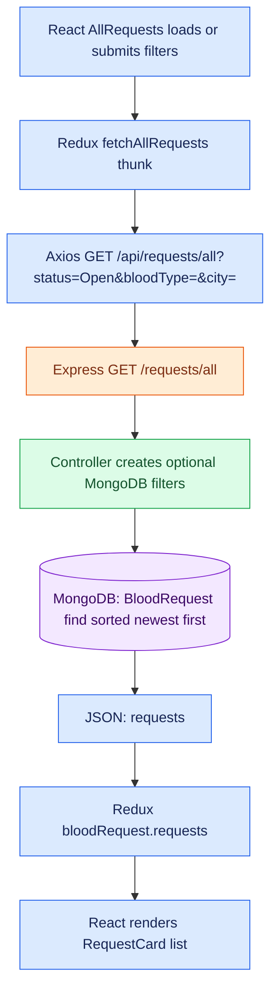

## 11. Other application pages and supported API flows

| Page / feature | Current behaviour |
| --- | --- |
| `NotFound` | React-only fallback page; it makes no API request. |
| Logout | The Navbar dispatches the Redux `logout` reducer, which clears `reddrop_token` and `reddrop_user` from local storage. There is currently no `POST /api/auth/logout` endpoint or refresh-token store. |
| User profile update API | `PUT /api/users/profile` is implemented with JWT protection and updates the `User` document. There is no dedicated Profile or Edit Profile page in the current React routes. |
| Donation drives API | `GET /api/drives/active` and admin-only `POST /api/drives/create` are implemented, but no current frontend page calls them. |
| Notifications, posts/feed, chat, Socket.io, Cloudinary/Multer | These are **not implemented** in this codebase. They should not be presented as existing workflows until routes, controllers, models, and frontend pages are added. |

## Error handling lifecycle

Controllers throw errors through `express-async-handler`. The final error middleware returns `{ "message": "..." }` (and a stack trace only outside production). Axios thunks convert this to a rejected Redux action; pages display it as a toast or inline state.

```mermaid
flowchart LR
  A[Validation, auth, or database failure] --> B[Controller throws error]
  B --> C[Express errorHandler middleware]
  C --> D[HTTP JSON response: message]
  D --> E[Axios rejected promise]
  E --> F[Redux rejected action: error state]
  F --> G[React toast / error UI]

  classDef backend fill:#dcfce7,stroke:#16a34a,color:#14532d;
  classDef error fill:#fee2e2,stroke:#dc2626,color:#7f1d1d;
  classDef frontend fill:#dbeafe,stroke:#2563eb,color:#172554;
  class A,B backend;
  class C,D error;
  class E,F,G frontend;
```
